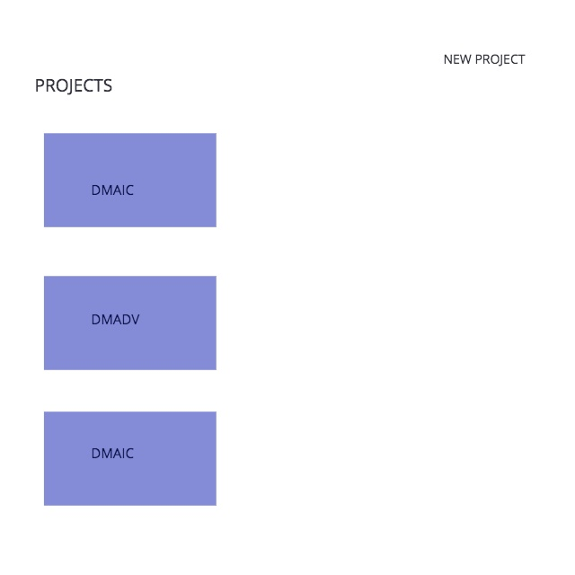
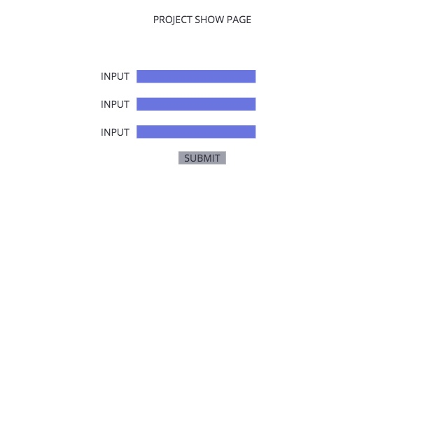
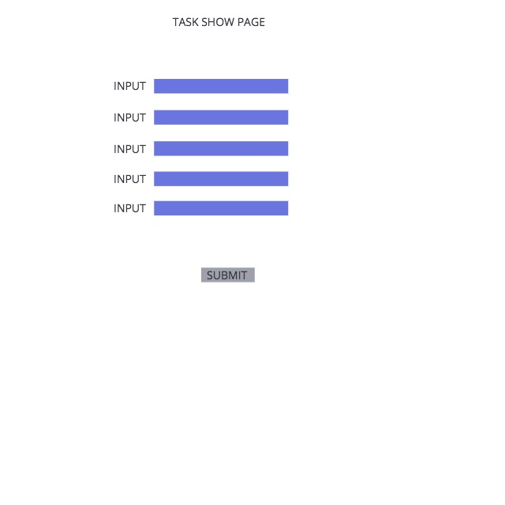
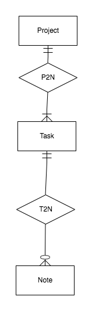

# Projectile

<h1>Overview:</h1>

Projectile - Project Management Web Application that allows you to create process improvement projects and monitor their tasks.

View <a href="https://trello.com/b/RMYvr9HC/wdi-project-4-projectile" >Trello Board</a>
View <a href="https://projectilefx.herokuapp.com/" >Demo</a>

Wireframes:

Entity Relationship Diagram:

<h2>Technologies:</h2> 
<li>HTML5</li>
<li>CSS3</li>
<li>EcmaScript</li>
<li>MongoDB</li>
<li>Mongoose</li>
<li>Express</li>
<li>Node.js</li>
<li>React</li>
<li>Styled Components</li>
<li>Bootstrap</li>
<li>Reactstrap</li>
<li>React router</li>

<h2>Features:</h2>
<li>CRUD</li>

<h2>Version 2:</h2> Add more task types and forms.
